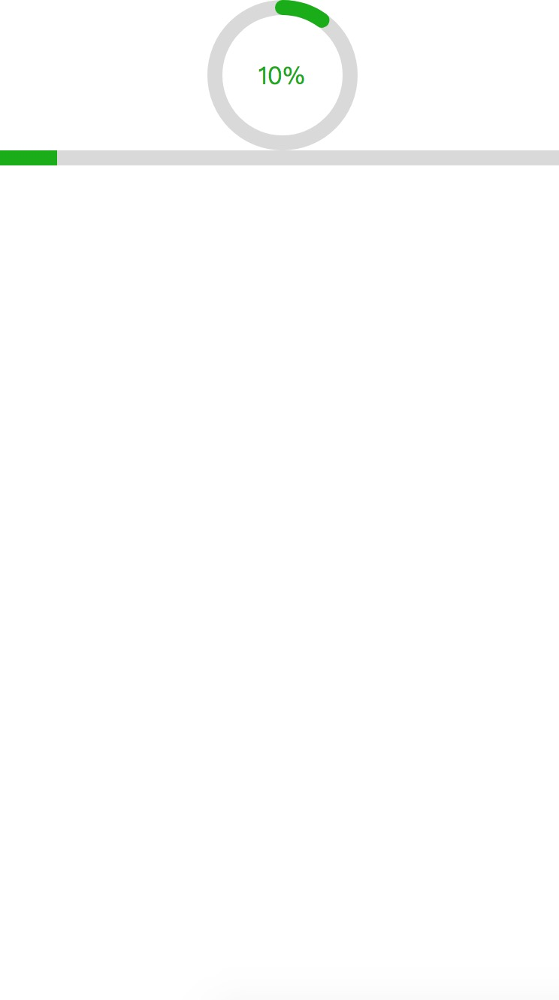

## Progress

> import { Progress } from 'wue';


| 参数           | 类型          | 说明  | 可选值| 默认值|
| ------------- |:-------------:| -----:|-----:|-----:|
|height| Number | 进度条高度||3|
|clear| Boolean | 是否显示取消按钮||false|
|on-cancel| Event | 取消时触发的时间|


```html
<template>
    <div>
        <wue-progress type="circle" v-model="value" :line-width="10"></wue-progress>
        <wue-progress type="line" v-model="value" :line-width="10"></wue-progress>
    </div>
  
</template>

<script type="text/babel">
    import WueProgress from "../../../src/components/progress/index";
    
    export default {
        components: {
            WueProgress,
        },
        
        data(){
            return {
                value: 0
            };
        },
        
        mounted(){
            const self = this;
            
            const t = setInterval(function () {
                self.value += 1;
                
                if(self.value === 100){
                    clearInterval(t);
                }
            }, 500);
        }
    }
</script>
```


