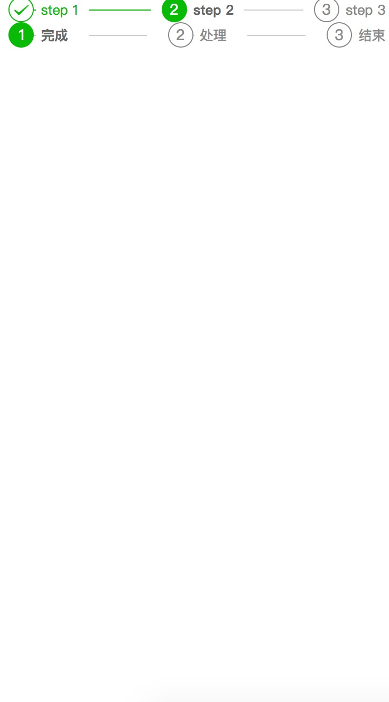

```
<template>
    <div style="width: 95%;margin: 0 auto;">
        <div>
            <wue-step v-model="step1" background-color='#fbf9fe'>
                <wue-step-item title="step 1" description="step 1"></wue-step-item>
                <wue-step-item title="step 2" description="step 2"></wue-step-item>
                <wue-step-item title="step 3" description="step 3"></wue-step-item>
            </wue-step>
        </div>
        <div>
            <wue-step v-model="step2" background-color='#fbf9fe' gutter="20px">
                <wue-step-item title="完成"></wue-step-item>
                <wue-step-item title="处理"></wue-step-item>
                <wue-step-item title="结束"></wue-step-item>
            </wue-step>
        </div>
        
        
        <button @click="nextStep">name</button>
    </div>
</template>

<script>
    import step from '../../../src/components/step/index.vue';
    import stepitem from '../../../src/components/step/item.vue';

    export default {
        components: {
            'wue-step': step,
            'wue-step-item': stepitem,
        },
        data () {
            return {
                step1: 1,
                step2: 0
            }
        },
        methods: {
            nextStep () {
                this.step2 ++
            }
        }
    }
</script>

<style lang="less">
    .btn_wrap {
        padding: 0 1rem;
        margin-top: 2rem;
    }
</style>

```

